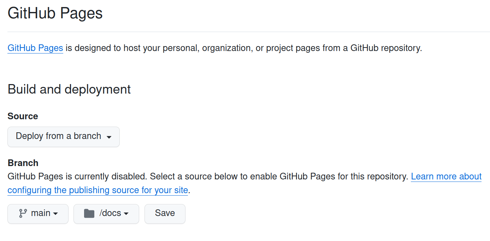
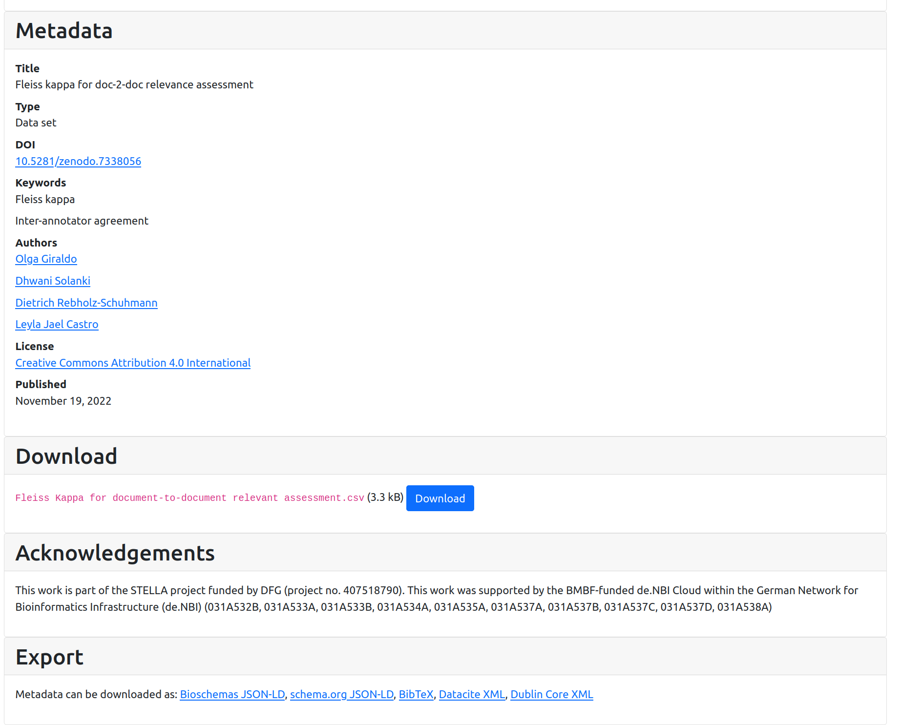
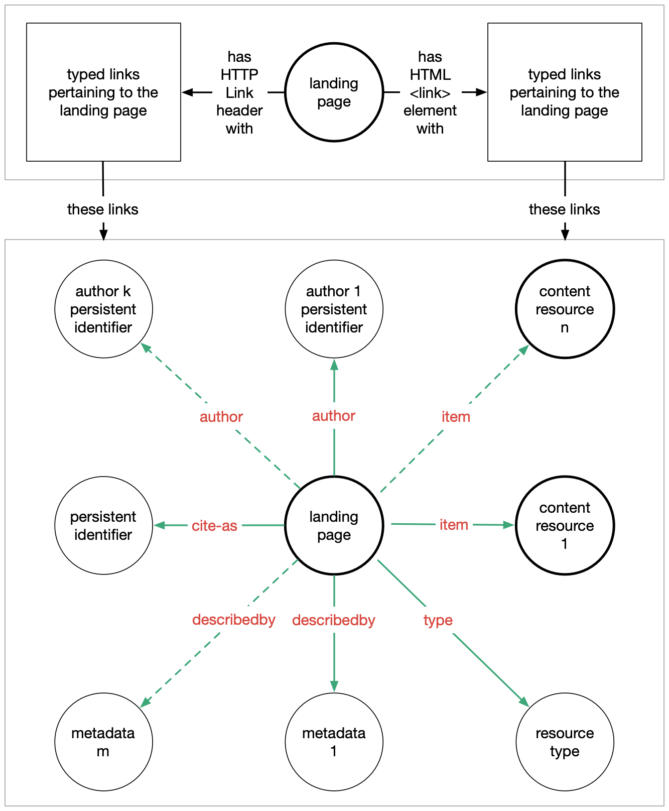
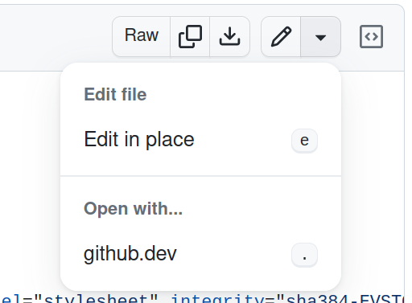
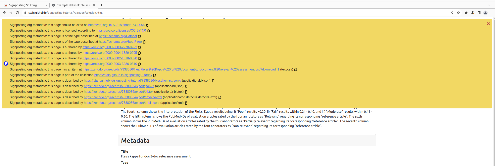

# signposting-tutorial

## Overview
* __Name:__ Tutorial on adding Signposting to HTML in Web pages
* __Description:__ This tutorial shows how to add Signposting to GitHub pages. It uses a simple GitHub page hosted in the `docs/` folder to create a sample project page, i.e., as learners could do with their own GitHub projects. As an example, it uses the dataset corresponding to the released project [TREC-doc-2-doc-relevance](https://github.com/zbmed-semtec/TREC-doc-2-doc-relevance), a web-based interface to add document-to-document relevance assessments to pairs of documents retrieved from [TREC 2005 Genomics Track](https://trec.nist.gov/data/genomics/05/genomics.qrels.large.txt). 
* __Keywords:__ Signposting, GitHub pages

 __Questions__
* How can I add Signposting to GitHub pages?
* How can I include external metadata in my signposting?
* How do I decide which metadata to include in signposting?

 __Learning outcomes__
* Describe how Signposting can be embedded in GitHub pages
* Understanding of Signposting limitation of static content-delivery networks
* Knowledge of different metadata formats and their signposting profiles
 

 __Requirements__
* Familiarity on how to use [GitHub](https://docs.github.com/en/get-started/start-your-journey) 
* Basic knowledge on how to use [GitHub Pages](https://pages.github.com/)
* Brief understanding of Signposting (introduction slides)
* Familiarity with HTML
* Knowledge of developer tools on a browser

 __Time estimation__ 30 minutes

 __Level__ Beginner / Introductory

 __Published__ 2024-02-25

 __Latest modification__ 2024-02-25

 __License__ [CC-By 4.0](https://spdx.org/licenses/CC-BY-4.0)

 __Version__ 0.1.0

<!-- __Identifier__ [DOI:10.5281/zenodo.10629453](https://doi.org/10.5281/zenodo.10629453)

 __Citation__ Castro, LJ. (2024, February 7). Adding Bioschemas Dataset and ComputationalTool markup to GitHub pages. Zenodo. https://doi.org/10.5281/zenodo.10629453
-->

## Learning experience

### Agenda
In this tutorial we will cover:
- [signposting-tutorial](#signposting-tutorial)
  - [Overview](#overview)
  - [Learning experience](#learning-experience)
    - [Agenda](#agenda)
    - [Prerequisites](#prerequisites)
    - [Creating this GitHub Page](#creating-this-github-page)
    - [Overview of the repository](#overview-of-the-repository)
    - [Challenge of machine actionability](#challenge-of-machine-actionability)
    - [Adding FAIR Signposting](#adding-fair-signposting)
    - [Where to add Signposting?](#where-to-add-signposting)
    - [Adding a persistent identifier](#adding-a-persistent-identifier)
      - [Using a w3id persistent identifier](#using-a-w3id-persistent-identifier)
    - [Specifying authors](#specifying-authors)
    - [Specifying license](#specifying-license)
    - [Specifying downloads](#specifying-downloads)
    - [Listing metadata](#listing-metadata)
  - [Try it out](#try-it-out)
    - [Command line / Python](#command-line--python)
    - [Signposting in browser](#signposting-in-browser)
  - [Acknowledgements](#acknowledgements)

### Prerequisites

To follow this tutorial, you should already have experience with using GitHub, and be signed in to your GitHub account. See [Learn the basics of GitHub](https://docs.github.com/en/get-started/start-your-journey) as a refresher.


### Creating this GitHub Page

 Let's start by forking [this repository](https://github.com/stain/signposting-tutorial) for your own purposes. Once forked, go to **Settings**


  You will need to enable _Pages_ on your forked repository, and select **Deploy from a branch** using  **Branch:** `main`  and **Folder**: `docs/`. Then **Save** the changes. 

As this repo does have a gh-pages branch, it will use it. If such branch would not exist, GitHub would ask you to use the main branch to start the gh-pages one



In a matter of minutes, your site will be live. The pages corresponding to the examples used in this tutorial are available at <https://stain.github.io/signposting-tutorial/> and corresponding pages should appear by replacing `stain` with your GitHub username.


Do not forget to check out a local copy of your fork so you can make changes -- alternatively you may use the GitHub editor.

### Overview of the repository

This repository is emulating a basic HTML-based institutional repository, with a single dataset entry corresponding to Zenodo's entry:

* [docs/](docs/) The Web root, as deployed above. Note that your deployment will use a hostname similar to `stain.github.io` but reflecting your username.
  - [docs/7338056/](docs/7338056/) A single dataset, based on a <a href="https://doi.org/10.5281/zenodo.7338056">real Zenodo entry</a>
    + [docs/7338056/index.html](docs/7338056/index.html) HTML for the dataset 7338056, at start of tutorial _without any signposting_
    + [docs/7338056/solution.html](docs/7338056/solution.html) Modified `index.html` after following this tutorial. Do not peek here until you have done the exercises!
    + [docs/7338056/bioschemas.jsonld](docs/7338056/bioschemas.jsonld) Bioschemas JSON-LD metadata as in the tutorial [bioschemas-ghpages-markup-tutorial](https://github.com/zbmed-semtec/bioschemas-ghpages-markup-tutorial), but extracted from `<script>` tag 

The remaining dataset and metadata downloads are in this case shown as deeplinks to Zenodo to indicate that Signposting is not tied to a particular domain.

Signposting is added at HTTP or HTML-level, and this tutorial is deployed using [GitHub Pages](https://pages.github.com/). For simplicity it uses static HTML files based on a [Bootstrap v5 starter template](https://getbootstrap.com/docs/5.0/getting-started/introduction) -- applying Signposting to a real repository deployment may require editing of its HTML templates, which is currently out of scope for this tutorial.


### Challenge of machine actionability

Look at HTML page <https://stain.github.io/signposting-tutorial/7338056/> and open the HTML code in [docs/7338056/index.html](docs/7338056/index.html). 
This is a somewhat typical _landing page_ for a Web-based data repository. We will imagine that the persistent identifier (DOI) has redirected to this page, as is the case for the original <https://doi.org/10.5281/zenodo.7338056>



We see that the landing page is quite useful for humans, including an abstract, metadata including title, author, keywords, and a big download button. There are some export formats listed at the end for formats like Bibtex.

The tutorial [bioschemas-ghpages-markup-tutorial](https://github.com/zbmed-semtec/bioschemas-ghpages-markup-tutorial) highlights how this kind of metadata can be made machine-readable in a FAIR format -- which for completeness is included in the `<script>` tag at the end of the HTML. This however just one of the many ways that FAIR metadata can be provided, and many repositories (as shown in this example).

However, a machine (example: pre-programmed script) who accesses the given persistent identifier, and do not already know this particular repository implementation or Bioschemas, is not immediately able to answer the most basic FAIR questions:

* What is the persistent identifier?
* What is the type of the resource described?
* Where can it download the data (if any), and in which format(s)?
* What is the license and authorship of the data?
* What other metadata formats are available? What conventions do they follow?

The goal of [Signposting](https://signposting.org/) is to reduce the heuristics that would otherwise be needed by such clients (e.g. text mining or content-negotiation), to give explicit typed links to facilitate _navigation_. Note that this is different from _semantics_, as the main goal is to give the client further waypoints rather than meaning.

### Adding FAIR Signposting

In this tutorial we will implement [FAIR Signposting](https://signposting.org/FAIR/) at [level 1](https://signposting.org/FAIR/#level1), which provides:

* Author(s)
* Persistent identifiers
* Metadata
* Download/archive
* License
* Type




### Where to add Signposting?

Signposting can be added in three ways:

1. In the HTTP `GET` / `HEAD` response, using `Link` header
2. In a HTML landing page, within the HTML `<head>` section using `<link>` element
3. In a dedicated linkset JSON or text file, linked to using any of the above

As this tutorial is neutral to deployment, and GitHub Pages do not permit control over HTTP headers, we will primarily work with option 2.

  To add the HTML links _to your forked repository_, now open [docs/7338056/index.html](docs/7338056/index.html) and click either _Edit in place_ button or the more powerful _Open with github.dev_.



If you don't see these options, make sure you are on your fork of the repository. 

Towards the top of the file, you will find two tags we will expand:


```html
<!-- Bootstrap CSS -->
<link href="https://cdn.jsdelivr.net/npm/bootstrap@5.0.2/dist/css/bootstrap.min.css"  
    rel="stylesheet" integrity="sha384-EVSTQN3/..." crossorigin="anonymous">

<!-- Copy and modify below line to add Signposting -->    
<link href="" rel="self" />
```

The first line shows how we are using the existing HTML mechanism for linking, `rel=stylesheet` tells the browser how to add the styling using the linked Bootstrap theme.

The second line is a template which we'll copy and modify in the instructions below. In the end you may delete this example line, as `rel=self` is not needed in HTML documents.

Make sure you add the new links within the `<head> .... </head>` section, as recommended by FAIR Signposting.  To simplify life for clients, it is NOT RECOMMENDED to add `<link>` to the `<body>` content.


### Adding a persistent identifier

 The [FAIR Guiding Principles](https://doi.org/10.1038/sdata.2016.18) include:

> F1. (meta)data are assigned a globally unique and persistent identifier  
> ...  
> F3. metadata clearly and explicitly include the identifier of the data it describes  

Persistent identifiers as expressed in Signposting using `rel="cite-as"` ([RFC8574](https://www.iana.org/go/rfc8574)) -- this allows a landing page to say which persistent identifier will redirect to the page.

The original entry for this dataset has a DOI `10.5281/zenodo.7338056` -- however DOIs as untyped strings are not a good targets, as every Signposting has to be a valid [URI](https://en.wikipedia.org/wiki/Uniform_Resource_Identifier) -- typically starting with `http://` or `https://` followed by a domain name for the corresponding Web server. For DOIs we will therefore use the `https://doi.org/` _resolver_ -- to convert the DOI to a URI, simply add this as a prefix to become: <https://doi.org/10.5281/zenodo.7338056>

 Modify docs/7338056/index.html so that it includes the signposting for the DOI `10.5281/zenodo.7338056`:

```html
<link href="https://doi.org/10.5281/zenodo.7338056" rel="cite-as" />
```

#### Using a w3id persistent identifier

Note however that the purpose of `cite-as` is not to give any odd scholarly citation, but a persistent identifier that _leads back to this place_.  In this idealized example we have duplicated a Zenodo entry, however their DOI <https://doi.org/10.5281/zenodo.7338056> of course will still redirect to their landing page <https://zenodo.org/records/7338056> and we are not at power to modify their HTML template.
alt text
    https://w3id.org/signposting-tutorial/{user}.{number}

Add the below signposting to reflect your username, and use this instead as a `cite-as`:

```html
<link href="https://w3id.org/signposting-tutorial/stain.7338056" https://spdx.org/licenses/CC-BY-4.0"
 If you manage a repository, you likely already assign persistent identifiers that can be used with `cite-as` -- if not, consider these resources:

* [Identifiers for the 21st century](https://doi.org/10.1371/journal.pbio.2001414): How to design, provision, and reuse persistent identifiers to maximize utility and impact of life science data
* [DataCite: Create DOIs](https://datacite.org/create-dois/)
* [w3id](https://w3id.org/): Permanent identifiers for the Web
* [b2handle](https://www.eudat.eu/services/userdoc/b2handle)


### Specifying the resource type

The FAIR Signposting requires a `type` to classify the scholarly object, in our case a CSV file. 

 Browse the [Schema.org hierarchy](https://schema.org/docs/full.html) to expand `CreativeWork` and find the type `Dataset` (other common types may be `ScholarlyArticle`, `ImageObject`, `SoftwareSourceCode`)

  To specify `Dataset` as a type, use:

```html
<link href="https://schema.org/Dataset" rel="type" />
```

**Note**: This schema.org identifier is subtly different from the JSON-LD usage in Bioschemas, which `@context` maps `Dataset` to `http://schema.org/Dataset` etc. As Signposting is navigational and not semantic, we here prefer the `https://` variant.

Now, the resource we are providing the signposting from is not technically speaking the dataset, but a landing page _about_ the downloadable dataset. Therefore Signposting recommends also adding:

```html
<link href="https://schema.org/AboutPage" rel="type" />    
```

This may be a good time to [try it out](#try-it-out) using a signposting client to verify your changes to `index.html`.


### Specifying authors

If each author of the resource have some persistent identifier (e.g. [ORCID](https://orcid.org/)), or other user page within the repository, we can list them using `author` link relation.

  Add for each of the authors listed in the HTML their ORCID identifier using `rel="author"`:

```html
    <link href="https://orcid.org/0000-0003-2978-8922" rel="author" />
```

Note that if the author does not have a page but only a name, you can't provide a link nor persistent identifier, and so there is nothing to signpost to. Remember the purpose here is navigation, full semantics is however left in the metadata, which we'll cover later.

### Specifying license

In many cases, a repository entry has an open access or open source license. In this case it is very valuable to provide the `license` signposting, in order to indicate to clients what they are permitted to do with the download. 

  In our first attempt, let's specify the [Creative Commons CC-BY 4.0](https://creativecommons.org/licenses/by/4.0/) license by using the URI as provided in the HTML:

```html
<link href="https://creativecommons.org/licenses/by/4.0/" rel="license" />
```

Needless to say, there are many possible license, each of which may have many identifiers. So while this link may be useful for humans, for machine actionability it is preferrably to use a known persistent identifier also for the license.

 The [SPDX License List](https://spdx.org/licenses/) is such a well known set of license identifiers. Identify the line for _"Creative Commons Attribution 4.0 International"_. Remember signposting can't go to untyped identifiers like `CC-BY-4.0` but needs a URI. Luckily SPDX provides such URIs e.g. <https://spdx.org/licenses/CC-BY-4.0> (although, for unexplained reasons, their list links to `.html` variants). 

 Modify the above `license` to use the SPDX persistent identifier:

```html
<link href="https://spdx.org/licenses/CC-BY-4.0" rel="license" />
```

In other cases there is no single license, or the license is only embedded within the dataset. In this case you should not include a `license` as you don't have a single resource to link to.

**Tip**: Make sure you use the US spelling of the link relation `license`!


### Specifying downloads

Returning to the FAIR Principles we also find:

> A1. (meta)data are retrievable by their identifier using a standardized communications protocol

If we accept that many persistent identifier goes to a HTML landing page, rather than directly to the downloadable data (which would then hide the metadata), **A1** must be enabled for machine through an indirection. In Signposting this is done using the `item` link relation.

From the [existing HTML](https://stain.github.io/signposting-tutorial/7338056/#download) we find the CSV file as a Download link. 

  Add the signposting for the download:

```html
<link 
    href="https://zenodo.org/records/7338056/files/Fleiss%20Kappa%20for%20document-to-document%20relevant%20assessment.csv?download=1"
    rel="item"
    type="text/csv" />
```

Note that although `type` is optional, it is strongly recommended for downloads, specially if the server is unable to return a correct `Content-Type`. 

  See the [IANA media types](https://www.iana.org/assignments/media-types/) or [PRONOM](https://www.nationalarchives.gov.uk/PRONOM/) to find known file formats.


It is possible to have additional downloads. For instance, Zenodo entries can have multiple uploads for a single DOI/landing page. In this tutorial repository, we have included the [fleiss.tsv](docs/7338056/fleiss.tsv) as an example of an additional resource, converted from the CSV to the Tabular Separated Values format .

Add another download for our converted TSV file:

```html
<link 
    href="fleiss.tsv"
    rel="item"
    type="text/tab-separated-values" />
```

**Note**: There is no indication in the outgoing links that these are alternatives of the same resource (the table). This could have to be done using `rel=alternate` at a HTTP header level for each of the files, however this is not required by Signposting. Likewise, provenance history of a conversion taking place would be the role of metadata to cover.


### Listing metadata


## Try it out

In order to try out Signposting we will try two alternative Signposting clients. 

 Ensure you have **committed** and **pushed** your code to Github, allowing the page to rebuild. Visit the **Actions** tab in the GitHub repository to ensure the build succeeded as before.

After visiting **your** page, e.g. `https://USER.github.io/signposting-tutorial/7338056/` , you may use **Inspect Element** in the Browser to check the `<link>` headers have been added correctly -- however your browser will by default not do any further validation.

### Command line / Python

If you are comfortable using the command line, and have [Python](https://www.python.org/) 3.7 or later installed, then install the [signposting](https://pypi.org/project/signposting/) Python package:

```shell
pip install signposting
```

Verify the tool is installed on the `PATH`:

```shell
(base) stain@xena:~/src/signposting-tutorial$ signposting --help
usage: signposting [-h] [--http] [--html] [--linkset] [-D] [-c] url [url ...]

positional arguments:
  url                URL(s) to discover signposting for

optional arguments:
  -h, --help         show this help message and exit
  --http             Find signposting in HTTP Link headers
  --html             Find signposting in <link> HTML elements if media-type matches
  --linkset          Find signposting in RFC9264 JSON or text linksets if media-type matches. When used with --recurse without specifying --http or --html, use those signposts to recurse, but
                     only report from linksets
  -D, --distinct     Report each signposting method (--http, --html and --linkset) separately
  -c, --any-context  Include signposts any contexts/anchors, not just resolved URI
```

Now try it on your GitHub deployment:

```shell
(base) stain@xena:~/src/signposting-tutorial$ signposting https://stain.github.io/signposting-tutorial/7338056/
Signposting for https://stain.github.io/signposting-tutorial/7338056/ 
CiteAs: <https://doi.org/10.5281/zenodo.7338056>
Type: <https://schema.org/AboutPage>
      <https://schema.org/Dataset>
Collection: <https://stain.github.io/signposting-tutorial/>
License: <https://spdx.org/licenses/CC-BY-4.0>
Author: <https://orcid.org/0000-0003-2978-8922>
        <https://orcid.org/0009-0004-1529-0095>
        <https://orcid.org/0000-0003-3986-0510>
        <https://orcid.org/0000-0002-1018-0370>
DescribedBy: <https://stain.github.io/signposting-tutorial/7338056/bioschemas.jsonld> application/ld+json
             <https://zenodo.org/records/7338056/export/dublincore> application/xml
             <https://zenodo.org/records/7338056/export/bibtex> application/x-bibtex
             <https://zenodo.org/records/7338056/export/json-ld> application/ld+json
             <https://zenodo.org/records/7338056/export/datacite-xml> application/vnd.datacite.datacite+xml
Item: <https://zenodo.org/records/7338056/files/Fleiss%20Kappa%20for%20document-to-document%20relevant%20assessment.csv?download=1> text/csv
```

If you have made a mistake, this library is likely to skip the particular signposting, or give a warning.

The Signposting Python library can also be [used programmatically](https://signposting.readthedocs.io/) from other Python programs. See [Signposting adopters](https://signposting.org/adopters/) for a complete list of software and repositories working with Signposting.
alt text

### Signposting in browser

An experimental browser plugin for the [Chrome browser](https://www.google.com/intl/en_uk/chrome/) (and its derivatives Chromium, Edge etc.) is available as [Signposting Sniffing](https://chromewebstore.google.com/detail/signposting-sniffing/pahanegeimljfcnjogglnamnlcgipmbc). Click **Add to Chrome** to enable this plugin. Note that although the plugin has access to inspect every web page, it should not be doing any external requests.

When Signposting is detected in a page, it will be presented as an overlay. After installing the plugin again, re-visit your dataset page in that browser. 




## Acknowledgements
This tutorial is based on [bioschemas-ghpages-markup-tutorial](https://github.com/zbmed-semtec/bioschemas-ghpages-markup-tutorial), [bioschemas-github-markup-example](https://github.com/zbmed-semtec/bioschemas-github-markup-example) and [Adding schema.org to a GitHub Pages site](https://bioschemas.org/tutorials/howto/howto_add_github).

LJC has received fundings from the [German Research Foundation (DFG)](https://www.dfg.de/en) via the grant for NFDI4DataScience No. [460234259](https://gepris.dfg.de/gepris/projekt/460234259)

We use free SVG icons from [Font Awesone](https://fontawesome.com/)
